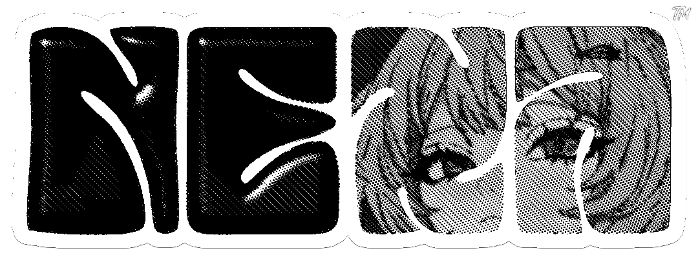

<!-- desc -->
<i>A crazy lightweight, hyper-aesthetic WhatsApp assistant engineered to handle complex automation without breaking a sweat.  Nexa is not just another bot, it’s designed to bridge the gap between seamless functionality and raw performance. From auto-reply, media tools, to smart automation, Nexa runs light on resources but hits hard on features!</i>

 

<!-- badge -->

<!--

-->

<!-- marker -->